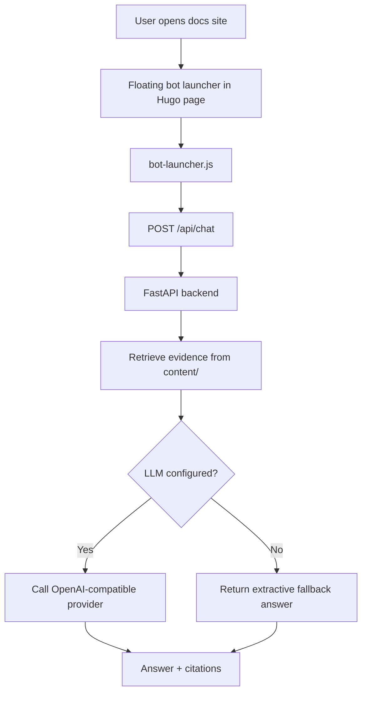

## Bot Architecture Deep Dive

This page is the detailed engineering note for the website bot used in the Knockoff Pipeline site.
It explains the actual implementation in this repository rather than a generic chatbot pattern.

## 1. Project Positioning

This bot is not implemented as a general agent.
It is a repository-grounded Q\&A layer attached to the existing Hugo documentation site.

Its job is:

- to answer questions from the published knockoff documentation
- to stay visually lightweight inside the site
- to support both local development and hosted production
- to degrade safely when the LLM provider is unavailable

At a high level, the system is:

- static frontend on the docs site
- lightweight retrieval backend
- optional LLM synthesis on top of retrieved evidence

## 2. High-level Architecture

The stack is intentionally split:

- website rendering is static
- bot runtime is dynamic
- knowledge source is repository content

## 3. Frontend Stack

### 3.1 Site framework

The public site is built with:

- `Hugo`
- `Hextra`

Key config:

- [hugo.yaml](/Users/bytedance/Documents/knockoff-pipeline/hugo.yaml)

What this config controls for the bot:

- whether the bot is enabled
- which remote API the public site should call
- bilingual content structure (`content/en`, `content/zh`)

### 3.2 Bot UI injection

The bot is added through the global scripts partial:

- [layouts/_partials/scripts.html](/Users/bytedance/Documents/knockoff-pipeline/layouts/_partials/scripts.html)

This file:

- injects the floating launcher DOM into every page
- sets localized UI strings through `data-*` attributes
- exposes two API URLs:
  - deployed API URL for production
  - `127.0.0.1:8000` for localhost development

### 3.3 Bot interaction layer

The browser logic is implemented in:

- [static/bot-launcher.js](/Users/bytedance/Documents/knockoff-pipeline/static/bot-launcher.js)

Responsibilities:

- drag-and-drop position handling
- launcher open/close behavior
- local position persistence through `localStorage`
- health check against the backend
- form submission to `/api/chat`
- message rendering
- citation rendering
- local/remote API switching

Notable behavior:

- on `localhost` or `127.0.0.1`, it prefers the local backend
- on the public site, it uses the Hugging Face Space API

### 3.4 Styling

The floating icon and panel are styled in:

- [assets/css/custom.css](/Users/bytedance/Documents/knockoff-pipeline/assets/css/custom.css)

This file controls:

- fixed positioning
- draggable launcher size and appearance
- chat panel layout
- citations list
- mobile layout adjustments

## 4. Backend Stack

### 4.1 Framework

The backend is:

- `Python 3.13`
- `FastAPI`
- `Uvicorn`
- `Pydantic`
- `httpx`

Dependencies:

- [requirements.txt](/Users/bytedance/Documents/knockoff-pipeline/requirements.txt)

Container entrypoint:

- [Dockerfile](/Users/bytedance/Documents/knockoff-pipeline/Dockerfile)

### 4.2 API entry

The API is defined in:

- [backend/app.py](/Users/bytedance/Documents/knockoff-pipeline/backend/app.py)

Endpoints:

- `/api/health`
- `/api/chat`
- `/api/reindex`

Core request path:

1. ensure index exists
2. retrieve grounded evidence
3. sanitize file paths for output
4. if LLM is configured, synthesize answer
5. otherwise return extractive fallback

### 4.3 Runtime state

The backend stores local runtime cache in:

- `runtime/bot/index.json`

Important distinction:

- this is cache, not the source of truth
- the real knowledge source is repository `content/`

If `runtime/` is deleted:

- local startup rebuilds the index
- production still works because the deployed bundle includes `content/`

## 5. Retrieval Layer

Retrieval is implemented in:

- [backend/rag.py](/Users/bytedance/Documents/knockoff-pipeline/backend/rag.py)

This is a lightweight lexical RAG implementation, not a vector database pipeline.

### 5.1 Source collection

The backend reads knowledge sources from:

- `KNOCKOFF_BOT_SOURCES`, if explicitly configured
- otherwise `content/` only

This behavior lives in:

- [backend/settings.py](/Users/bytedance/Documents/knockoff-pipeline/backend/settings.py)

### 5.2 Parsing

Current parsing strategy:

- markdown and rst are stripped to plain text
- whitespace is normalized
- code fences and markdown syntax are removed

### 5.3 Chunking

Documents are split by paragraph into overlapping chunks.

Current defaults:

- chunk size around `900` characters
- overlap around `120` characters

### 5.4 Ranking

The ranking pipeline is:

1. tokenize question
2. tokenize chunk text
3. count term frequencies
4. compute a TF-IDF style lexical score
5. sort by score
6. keep top `k`

### 5.5 Language routing

The backend also applies language-aware retrieval:

- Chinese questions prefer `content/zh/`
- English questions prefer `content/en/`

This is critical because the site content is bilingual.
Without this filter, the LLM may receive mixed-language evidence and produce mixed-language answers.

### 5.6 Extractive fallback

If the LLM is disabled or fails:

- the backend ranks the best matching sentences from the retrieved chunks
- it returns a grounded extractive answer with citations

This makes the bot usable even when the provider is offline.

## 6. LLM Layer

LLM synthesis is implemented in:

- [backend/llm.py](/Users/bytedance/Documents/knockoff-pipeline/backend/llm.py)

### 6.1 Interface style

The backend does not use a provider-specific SDK.
Instead, it calls a shared OpenAI-compatible endpoint:

- `POST /chat/completions`

This keeps the provider swap simple.

### 6.2 Supported providers

Configured in:

- [backend/settings.py](/Users/bytedance/Documents/knockoff-pipeline/backend/settings.py)

Supported modes:

- OpenAI
- Groq
- OpenRouter
- Gemini
- Ollama

The same code path is reused for all of them through:

- provider-specific base URL
- provider-specific API key env var
- model name

### 6.3 Prompting strategy

The system prompt enforces:

- answer in the same language as the question
- do not invent unsupported claims
- use only supplied knockoff-related evidence
- include inline citations

This is not open-ended chatting.
It is evidence-constrained answer synthesis.

### 6.4 Failure handling

If provider calls fail:

- the exception is caught in [backend/app.py](/Users/bytedance/Documents/knockoff-pipeline/backend/app.py)
- the mode is downgraded to `extractive_fallback`
- the user still receives a grounded answer instead of a hard failure

## 7. Deployment Architecture

### 7.1 Static frontend

The site is built and deployed with GitHub Pages:

- [\.github/workflows/pages.yaml](/Users/bytedance/Documents/knockoff-pipeline/.github/workflows/pages.yaml)

This workflow:

- checks out the repo
- installs Hugo
- builds the static site
- uploads the `public/` artifact
- deploys to GitHub Pages

### 7.2 Dynamic backend

The API is deployed separately to Hugging Face Spaces:

- [\.github/workflows/hf-space.yaml](/Users/bytedance/Documents/knockoff-pipeline/.github/workflows/hf-space.yaml)
- [space/README.md](/Users/bytedance/Documents/knockoff-pipeline/space/README.md)

This workflow:

- checks whether `HF_SPACE_REPO` and `HF_TOKEN` exist
- prepares a clean bundle with:
  - `backend/`
  - `content/`
  - `Dockerfile`
  - `requirements.txt`
  - space metadata README
- force-pushes that bundle into the Hugging Face Space repo

### 7.3 Why split deployment

The split exists because:

- Hugo site is static and cheap to host
- bot requires Python execution and provider secrets
- public runtime should not depend on the developer laptop

This results in:

- GitHub Pages for docs
- Hugging Face Space for API

## 8. Local vs Production Behavior

### Local

When developing locally:

- run site + API
- `bot-launcher.js` detects localhost
- requests go to `http://127.0.0.1:8000/api`

### Production

When users open the public site:

- launcher uses the configured public API URL
- requests go to the deployed Hugging Face Space

This logic is intentionally frontend-driven so the same HTML can support both modes.

## 9. File-by-file Map

### Site integration

- [hugo.yaml](/Users/bytedance/Documents/knockoff-pipeline/hugo.yaml): bot enable flag, public API URL, bilingual structure
- [layouts/_partials/scripts.html](/Users/bytedance/Documents/knockoff-pipeline/layouts/_partials/scripts.html): bot root injection
- [static/bot-launcher.js](/Users/bytedance/Documents/knockoff-pipeline/static/bot-launcher.js): interactive client logic
- [assets/css/custom.css](/Users/bytedance/Documents/knockoff-pipeline/assets/css/custom.css): bot styles

### API

- [backend/app.py](/Users/bytedance/Documents/knockoff-pipeline/backend/app.py): endpoints and orchestration
- [backend/rag.py](/Users/bytedance/Documents/knockoff-pipeline/backend/rag.py): parsing, chunking, retrieval, fallback
- [backend/llm.py](/Users/bytedance/Documents/knockoff-pipeline/backend/llm.py): provider call
- [backend/settings.py](/Users/bytedance/Documents/knockoff-pipeline/backend/settings.py): provider config and source paths

### Deployment

- [Dockerfile](/Users/bytedance/Documents/knockoff-pipeline/Dockerfile): API container
- [requirements.txt](/Users/bytedance/Documents/knockoff-pipeline/requirements.txt): Python dependencies
- [\.github/workflows/pages.yaml](/Users/bytedance/Documents/knockoff-pipeline/.github/workflows/pages.yaml): static site deploy
- [\.github/workflows/hf-space.yaml](/Users/bytedance/Documents/knockoff-pipeline/.github/workflows/hf-space.yaml): backend sync to Space
- [space/README.md](/Users/bytedance/Documents/knockoff-pipeline/space/README.md): Space metadata

## 10. Operational Caveats

Current known tradeoffs:

- retrieval is lexical, not embedding-based
- `/api/reindex` is still public
- index invalidation is not fingerprint-aware at startup
- there is no persistent chat memory
- frontend answer rendering is not streaming

## 11. Why This Design Was Chosen

This implementation favors:

- low operational complexity
- repository-grounded answers
- simple provider swapping
- safe fallback behavior
- compatibility with static site hosting

It does not optimize for:

- multi-step autonomous tool use
- advanced vector search infrastructure
- long-lived memory
- high-throughput enterprise serving

That tradeoff is intentional.
The bot is meant to be a practical documentation assistant attached to a research platform.
