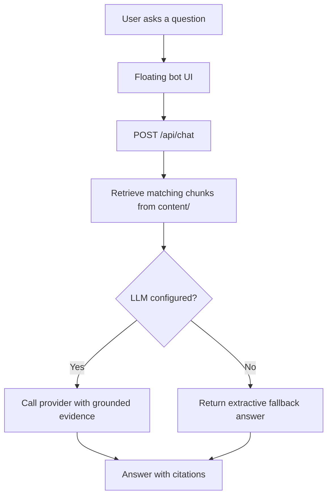

## Website Bot

This repository includes a floating bot embedded into the Knockoff Pipeline website.
It is designed as a lightweight RAG service rather than a full agent system.

## Goals

- answer questions grounded in the published knockoff documentation
- stay attached to the existing Hugo site instead of replacing it
- support both local development and hosted deployment
- fall back gracefully when an LLM provider is unavailable

## Stack

- Frontend: Hugo + Hextra + vanilla JavaScript + CSS
- Backend: FastAPI + Uvicorn
- Retrieval: local text parsing, chunking, token matching, TF-IDF style scoring
- LLM interface: OpenAI-compatible `/chat/completions`
- Supported providers: Gemini, OpenAI, Groq, OpenRouter, Ollama
- Hosting:
  - frontend on GitHub Pages
  - backend on Hugging Face Spaces (Docker)

## Main Files

- `layouts/_partials/scripts.html`
  - injects the floating bot root into the site layout
- `static/bot-launcher.js`
  - handles drag, open/close, request submission, and message rendering
- `assets/css/custom.css`
  - styles the floating icon and chat panel
- `backend/app.py`
  - exposes `/api/health`, `/api/chat`, `/api/reindex`
- `backend/rag.py`
  - parses documents, chunks content, retrieves evidence, and builds extractive fallback answers
- `backend/llm.py`
  - sends grounded evidence to the configured LLM provider
- `backend/settings.py`
  - loads provider settings and knowledge source paths

## Runtime Flow

## Retrieval Strategy

The current retrieval layer is intentionally simple:

- source files come from `content/` by default
- markdown is stripped to plain text
- documents are split into overlapping chunks
- the question is tokenized and matched against chunk term frequencies
- results are ranked with a TF-IDF style score
- the top chunks become evidence for either fallback output or LLM synthesis

The bot also prefers evidence in the same language as the question:

- English questions prefer `content/en/`
- Chinese questions prefer `content/zh/`

This prevents mixed-language answers when both language trees contain related material.

## Deployment Route

The production deployment is split:

1. GitHub Pages builds and serves the static Hugo site.
2. GitHub Actions syncs an API-only bundle to a Hugging Face Docker Space.
3. The public site calls the deployed Space API.
4. For local development, the launcher switches back to `http://127.0.0.1:8000/api`.

Relevant deployment files:

- `.github/workflows/pages.yaml`
- `.github/workflows/hf-space.yaml`
- `Dockerfile`
- `requirements.txt`
- `space/README.md`

## Local Cleanup Safety

The bot does not require your local generated cache to survive.

- `runtime/bot/index.json` is rebuildable cache data
- if you delete `runtime/`, the backend recreates the index from `content/` on startup
- the public Hugging Face Space has its own bundled copy of `content/`

So the bot still works after cleaning local generated data.
What you should not delete from the repository is `content/`, because that is the actual knowledge source.

## Current Limits

- retrieval is lexical, not embedding-based
- there is no persistent conversation memory
- `/api/reindex` is still open and should be restricted before broader public exposure
- index freshness is not yet automatically invalidated when source files change

## Next Improvements

- fingerprint-aware index refresh
- embedding or rerank-based retrieval
- tighter API protection
- streaming responses in the frontend
- provider/model status shown in the chat panel
