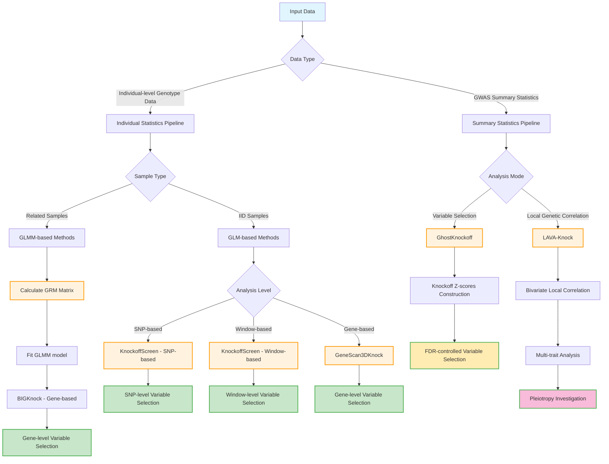

## Knockoff Pipeline Overview

This pipeline provides multiple statistical methods for variable selection and genetic analysis using knockoff statistics:

## Key Methods

### Individual-level Data Methods
- **KnockoffScreen**: Supports both SNP-based and window-based analysis using GLM for IID samples
- **GeneScan3DKnock**: Gene-based analysis using GLM for IID samples
- **BIGKnock**: Gene-based analysis using GLMM for related samples, requires GRM matrix calculation

### Summary Statistics Methods
- **GhostKnockoff**: Constructs knockoff Z-scores from GWAS summary statistics for variable selection
- **LAVA-Knock**: Extends GhostKnockoff for local genetic correlation analysis and pleiotropy investigation
