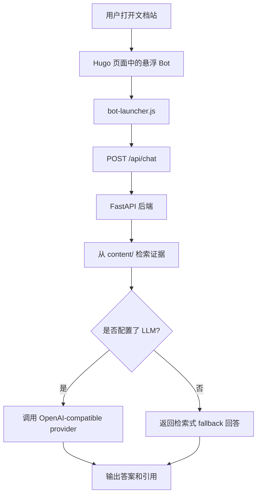

## Bot 技术架构详解

这份文档不是泛泛而谈的“聊天机器人介绍”，而是对当前仓库里这套 bot 实现方式的工程拆解。

目标是说明：

- 这套 bot 由哪些部分组成
- 每一层用了什么技术栈
- 问题从网页发出后是怎么到后端、再到模型的
- 本地运行和线上运行有什么区别
- 哪些文件在实际负责这些事情

## 1. 这个 Bot 的定位

这套 bot 不是一个通用 agent，也不是带工具调用的复杂智能体。

它更准确的定位是：

- 挂在 Hugo 文档站里的悬浮问答功能
- 基于仓库文档内容回答问题
- 先检索证据，再决定是否调用大模型总结
- 当大模型不可用时，退回到检索式回答

所以它本质上是一个轻量级、面向项目文档的 `RAG bot`。

## 2. 总体架构

可以把这套架构理解成三层：

- 静态网站层
- 动态问答后端层
- 可选的大模型总结层

## 3. 前端技术栈

### 3.1 网站框架

公开网站使用：

- `Hugo`
- `Hextra`

配置入口：

- [hugo.yaml](/Users/bytedance/Documents/knockoff-pipeline/hugo.yaml)

这里主要控制：

- 是否启用 bot
- 公网环境下 bot 请求哪个 API
- 双语内容目录 `content/en` 和 `content/zh`

### 3.2 Bot 注入方式

bot 不是单独开一个新站，而是通过站点布局局部注入：

- [layouts/_partials/scripts.html](/Users/bytedance/Documents/knockoff-pipeline/layouts/_partials/scripts.html)

这个文件负责：

- 在全站页面插入悬浮 bot 根节点
- 通过 `data-*` 属性注入中英文文案
- 同时暴露：
  - 公网 API 地址
  - 本地开发 API 地址

### 3.3 前端交互逻辑

浏览器端逻辑在：

- [static/bot-launcher.js](/Users/bytedance/Documents/knockoff-pipeline/static/bot-launcher.js)

它负责的事情很多：

- 右下角悬浮图标的拖拽
- 展开 / 收起聊天面板
- 记录图标位置到 `localStorage`
- 页面加载后请求 `/api/health`
- 提交问题到 `/api/chat`
- 渲染回答和 citation
- 根据域名判断走本地 API 还是远端 API

也就是说，这个文件本质上就是 bot 的前端控制器。

### 3.4 样式层

样式在：

- [assets/css/custom.css](/Users/bytedance/Documents/knockoff-pipeline/assets/css/custom.css)

控制内容包括：

- 悬浮图标尺寸和位置
- 弹出面板外观
- 消息卡片
- citation 列表
- 移动端适配

## 4. 后端技术栈

### 4.1 基础框架

后端使用：

- `Python 3.13`
- `FastAPI`
- `Uvicorn`
- `Pydantic`
- `httpx`

依赖文件：

- [requirements.txt](/Users/bytedance/Documents/knockoff-pipeline/requirements.txt)

容器入口：

- [Dockerfile](/Users/bytedance/Documents/knockoff-pipeline/Dockerfile)

### 4.2 API 入口

问答 API 在：

- [backend/app.py](/Users/bytedance/Documents/knockoff-pipeline/backend/app.py)

暴露的接口有：

- `/api/health`
- `/api/chat`
- `/api/reindex`

一次完整的问答流程是：

1. 检查索引是否存在
2. 从知识库检索候选证据
3. 清洗输出里的文件路径
4. 如果配置了 LLM，就进行证据约束下的总结回答
5. 如果没配置或失败，则退回到 fallback

### 4.3 运行时缓存

本地运行时缓存目录是：

- `runtime/bot/index.json`

这里必须区分两种东西：

- `runtime/` 是缓存
- `content/` 才是知识源

所以：

- 删除 `runtime/` 没关系，启动时会重建
- 删除并推送仓库里的 `content/`，bot 就失去知识来源

## 5. 检索层

检索逻辑在：

- [backend/rag.py](/Users/bytedance/Documents/knockoff-pipeline/backend/rag.py)

这部分不是向量数据库，也不是 embedding 检索，而是一个轻量级的词法检索实现。

### 5.1 知识源收集

来源由：

- [backend/settings.py](/Users/bytedance/Documents/knockoff-pipeline/backend/settings.py)

控制。

规则是：

- 如果配置了 `KNOCKOFF_BOT_SOURCES`，就按显式路径收集
- 否则默认只用 `content/`

### 5.2 文档解析

解析策略是：

- 对 markdown / rst 去掉 markdown 语法
- 正规化空白
- 变成纯文本后再切块

### 5.3 切块策略

当前切块大致是：

- 每块约 `900` 个字符
- 重叠约 `120` 个字符

切块目标不是做语义压缩，而是让后续检索命中更稳定。

### 5.4 排序策略

当前排序流程：

1. 对问题 tokenize
2. 对每个 chunk tokenize
3. 统计词频
4. 按类 TF-IDF 分数打分
5. 排序
6. 取 top-k

这是一个刻意保持轻量的设计：

- 不依赖向量库
- 部署简单
- 适合文档量不大的网站 bot

### 5.5 语言优先规则

因为网站是双语的，所以 bot 做了语言路由：

- 中文问题优先检索 `content/zh/`
- 英文问题优先检索 `content/en/`

这一步非常关键。
如果没有这个规则，中英文文档会同时命中，最后模型容易输出混合语言回答。

### 5.6 Fallback 输出

如果大模型不可用：

- 会从 top chunks 中抽取最匹配的句子
- 直接组成 grounded fallback answer
- 依然返回 citations

所以 bot 不会因为 provider 崩掉就完全不可用。

## 6. LLM 层

LLM 调用逻辑在：

- [backend/llm.py](/Users/bytedance/Documents/knockoff-pipeline/backend/llm.py)

### 6.1 接口形式

这层没有绑定某一家 SDK，而是统一走：

- OpenAI-compatible `/chat/completions`

这样好处是 provider 很容易切换。

### 6.2 支持的 provider

provider 默认配置在：

- [backend/settings.py](/Users/bytedance/Documents/knockoff-pipeline/backend/settings.py)

当前支持：

- OpenAI
- Groq
- OpenRouter
- Gemini
- Ollama

它们共享同一套调用路径，区别只是：

- `base_url`
- API key 环境变量
- `model`

### 6.3 Prompt 约束

当前系统提示词明确约束：

- 只能根据提供的 knockoff 证据回答
- 必须与问题语言一致
- 不允许中英文混写
- 需要带 inline citations
- 证据不足时要明确说不足
- 不允许捏造方法或参数

所以这不是自由生成，而是证据约束下的总结回答。

### 6.4 故障回退

如果 provider 报错：

- [backend/app.py](/Users/bytedance/Documents/knockoff-pipeline/backend/app.py) 会捕获异常
- 模式会切换为 `extractive_fallback`
- 返回 grounded answer 而不是 500 崩溃

## 7. 部署架构

### 7.1 前端静态部署

文档站通过 GitHub Pages 部署：

- [\.github/workflows/pages.yaml](/Users/bytedance/Documents/knockoff-pipeline/.github/workflows/pages.yaml)

这个 workflow 会：

- checkout 仓库
- 安装 Hugo
- 构建静态站
- 上传 `public/`
- 部署到 GitHub Pages

### 7.2 后端动态部署

bot API 独立部署到 Hugging Face Spaces：

- [\.github/workflows/hf-space.yaml](/Users/bytedance/Documents/knockoff-pipeline/.github/workflows/hf-space.yaml)
- [space/README.md](/Users/bytedance/Documents/knockoff-pipeline/space/README.md)

这个 workflow 做的事情是：

- 检查 `HF_SPACE_REPO` 与 `HF_TOKEN`
- 准备一个 API-only bundle
- bundle 包含：
  - `backend/`
  - `content/`
  - `Dockerfile`
  - `requirements.txt`
  - Space metadata README
- 强制推送到 Hugging Face Space 仓库

### 7.3 为什么要拆成两部分

原因很现实：

- Hugo 站点是静态网站，适合 GitHub Pages
- bot 后端需要 Python 运行环境和 provider secret
- 公网运行不能依赖开发机本地服务

最终形成：

- `GitHub Pages` 负责网站
- `Hugging Face Spaces` 负责 API

## 8. 本地和线上有什么区别

### 本地开发

在本地开发时：

- 启动 Hugo 站和本地 FastAPI
- `bot-launcher.js` 识别到 localhost
- 自动切到 `http://127.0.0.1:8000/api`

### 公网环境

线上用户打开网站时：

- launcher 使用 `hugo.yaml` 配置的公开 API 地址
- 请求被发到 Hugging Face Space

这也是为什么同一份前端 HTML 可以同时支持本地和生产。

## 9. 文件职责地图

### 站点层

- [hugo.yaml](/Users/bytedance/Documents/knockoff-pipeline/hugo.yaml)：bot 开关、公网 API、双语结构
- [layouts/_partials/scripts.html](/Users/bytedance/Documents/knockoff-pipeline/layouts/_partials/scripts.html)：注入 bot 根节点
- [static/bot-launcher.js](/Users/bytedance/Documents/knockoff-pipeline/static/bot-launcher.js)：前端交互控制器
- [assets/css/custom.css](/Users/bytedance/Documents/knockoff-pipeline/assets/css/custom.css)：bot 样式

### 后端层

- [backend/app.py](/Users/bytedance/Documents/knockoff-pipeline/backend/app.py)：接口和主流程编排
- [backend/rag.py](/Users/bytedance/Documents/knockoff-pipeline/backend/rag.py)：解析、切块、检索、fallback
- [backend/llm.py](/Users/bytedance/Documents/knockoff-pipeline/backend/llm.py)：LLM 调用
- [backend/settings.py](/Users/bytedance/Documents/knockoff-pipeline/backend/settings.py)：provider 和知识源配置

### 部署层

- [Dockerfile](/Users/bytedance/Documents/knockoff-pipeline/Dockerfile)：API 容器入口
- [requirements.txt](/Users/bytedance/Documents/knockoff-pipeline/requirements.txt)：依赖
- [\.github/workflows/pages.yaml](/Users/bytedance/Documents/knockoff-pipeline/.github/workflows/pages.yaml)：静态站部署
- [\.github/workflows/hf-space.yaml](/Users/bytedance/Documents/knockoff-pipeline/.github/workflows/hf-space.yaml)：Space 同步
- [space/README.md](/Users/bytedance/Documents/knockoff-pipeline/space/README.md)：Space 元信息

## 10. 当前限制

当前已知限制包括：

- 检索仍然是词法检索，不是 embedding 检索
- `/api/reindex` 仍然公开
- 启动时还没有做 fingerprint 驱动的索引失效判断
- 没有持久化多轮会话记忆
- 前端还不是流式输出

## 11. 为什么这套方案适合当前项目

这套方案优先考虑的是：

- 部署简单
- 和仓库文档强绑定
- provider 易切换
- 出故障时可回退
- 兼容静态文档站

它并不追求：

- 通用 agent 能力
- 大规模向量检索基础设施
- 长会话记忆
- 高并发企业级服务

这个取舍是刻意的。  
它更像一个挂在科研平台上的实用型文档助手，而不是独立的通用聊天产品。
