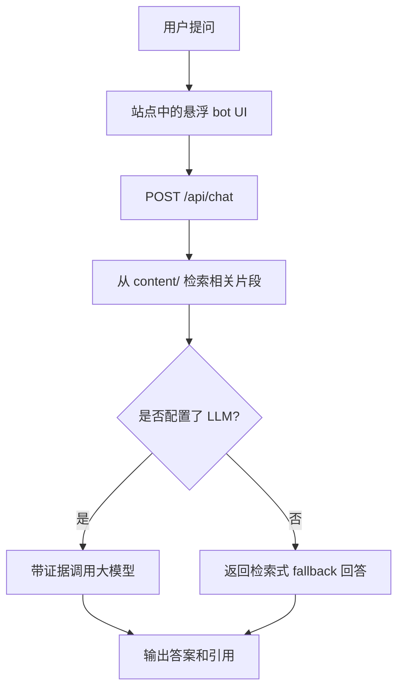

## Website Bot

这个仓库现在包含一个嵌入在 Knockoff Pipeline 网站里的悬浮 bot。  
它本质上是一个轻量级 `RAG` 问答功能，而不是完整的 agent 系统。

## 目标

- 基于站点中已经发布的 knockoff 文档进行问答
- 保持原有 Hugo 网站结构不变，只增加一个功能
- 同时支持本地开发和远端部署
- 当大模型不可用时，仍然能退回到检索式回答

## 技术栈

- 前端：Hugo + Hextra + 原生 JavaScript + CSS
- 后端：FastAPI + Uvicorn
- 检索：本地文本解析、切块、关键词匹配、类 TF-IDF 打分
- 大模型接口：OpenAI-compatible `/chat/completions`
- 支持的 provider：Gemini、OpenAI、Groq、OpenRouter、Ollama
- 部署：
  - 前端使用 GitHub Pages
  - 后端使用 Hugging Face Spaces（Docker）

## 主要文件

- `layouts/_partials/scripts.html`
  - 把悬浮 bot 根节点注入到站点布局中
- `static/bot-launcher.js`
  - 处理拖拽、展开/收起、发送请求、渲染消息
- `assets/css/custom.css`
  - 定义悬浮图标和聊天面板样式
- `backend/app.py`
  - 提供 `/api/health`、`/api/chat`、`/api/reindex`
- `backend/rag.py`
  - 负责文档解析、切块、检索和 fallback 摘句回答
- `backend/llm.py`
  - 把检索到的证据发送给配置好的大模型
- `backend/settings.py`
  - 读取 provider 配置和知识源路径

## 运行链路

## 检索策略

当前检索层是有意保持轻量的：

- 默认知识源是 `content/`
- Markdown 会先被清洗成纯文本
- 文档会被切成带重叠的多个 chunk
- 问题会被 tokenize，再与 chunk 的词频做匹配
- 使用类 TF-IDF 分数排序
- Top chunks 作为 fallback 回答或 LLM 总结回答的证据

另外，bot 现在已经加入了语言优先规则：

- 英文问题优先检索 `content/en/`
- 中文问题优先检索 `content/zh/`

这样可以减少中英文材料同时命中时出现的混合回答。

## 部署路线

生产部署被拆成两部分：

1. GitHub Pages 负责构建和托管静态 Hugo 网站。
2. GitHub Actions 把 API-only bundle 同步到 Hugging Face Docker Space。
3. 公网网站直接请求远端 Space API。
4. 本地开发时，bot 会自动切回 `http://127.0.0.1:8000/api`。

相关部署文件：

- `.github/workflows/pages.yaml`
- `.github/workflows/hf-space.yaml`
- `Dockerfile`
- `requirements.txt`
- `space/README.md`

## 本地清理后的可用性

这个 bot 不依赖你本地生成出来的缓存长期存在。

- `runtime/bot/index.json` 只是可重建的缓存
- 即使删除 `runtime/`，后端启动时也会基于 `content/` 重新建立索引
- 公网 Hugging Face Space 也有自己打包进去的一份 `content/`

所以，清理本地生成数据之后，bot 依然可以运行。  
真正不能随便删的是仓库里的 `content/`，因为它本身就是 bot 的知识源。

## 当前限制

- 检索还是关键词型，不是 embedding 检索
- 还没有持久化的多轮会话记忆
- `/api/reindex` 目前还是开放接口，公开使用前应加保护
- 索引还没有根据源文件变化自动失效刷新

## 后续改进方向

- 基于 fingerprint 的自动重建索引
- 引入 embedding 或 rerank 提升检索质量
- 收紧 API 安全策略
- 前端改成流式回答
- 在面板里展示当前 provider 和 model 状态
