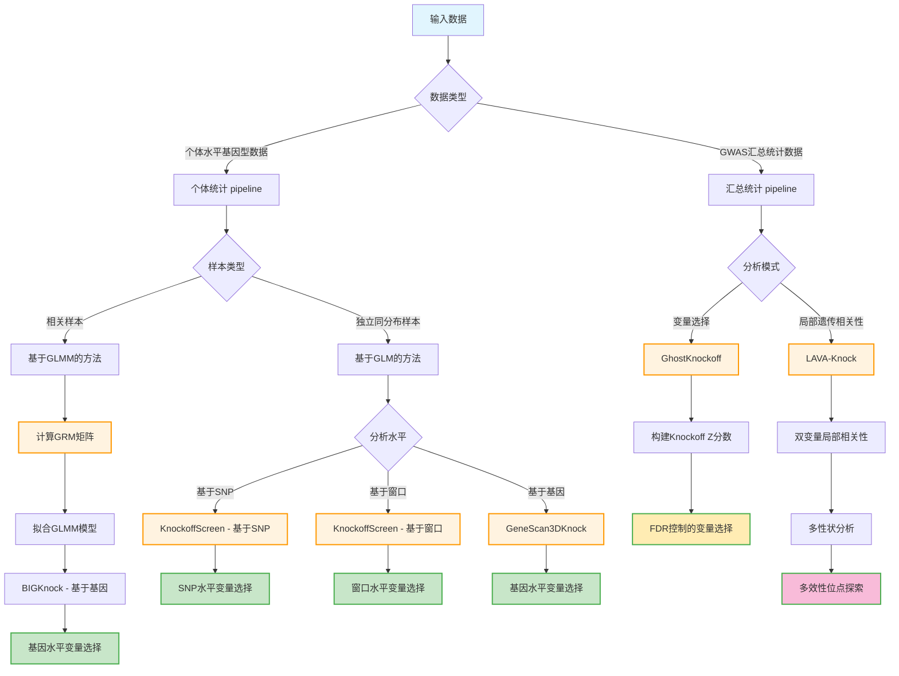

## Knockoff pipeline 概览

Knockoff pipeline 提供多种统计方法，使用knockoff统计量进行变量选择和遗传分析：

## 主要方法

### 个体水平数据方法
- **KnockoffScreen**：支持基于SNP和基于窗口的分析，针对独立同分布样本使用GLM
- **GeneScan3DKnock**：针对独立同分布样本的基于基因的分析，使用GLM
- **BIGKnock**：针对相关样本的基于基因的分析，使用GLMM，需要计算GRM矩阵

### 汇总统计方法
- **GhostKnockoff**：从GWAS汇总统计数据构建knockoff Z分数，用于变量选择
- **LAVA-Knock**：在GhostKnockoff基础上扩展，用于局部遗传相关性分析和多效性位点探索
